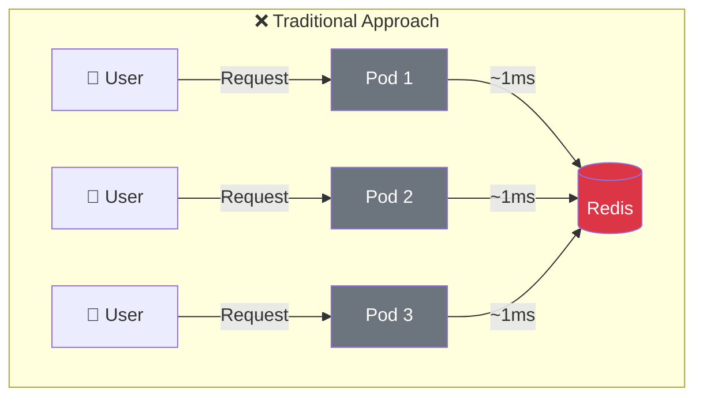
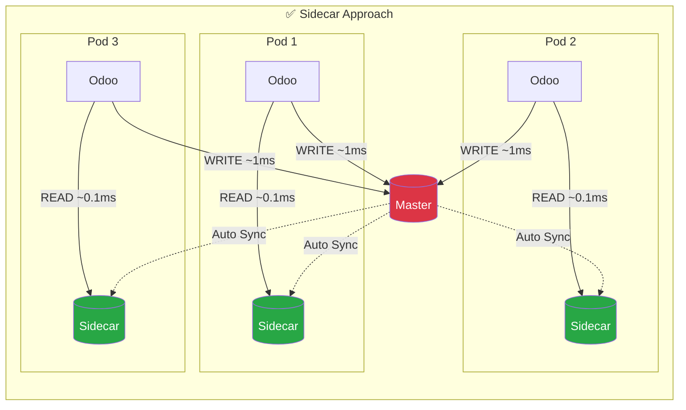
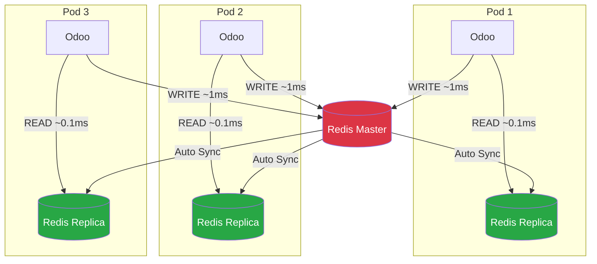
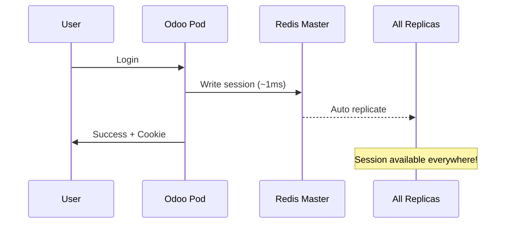
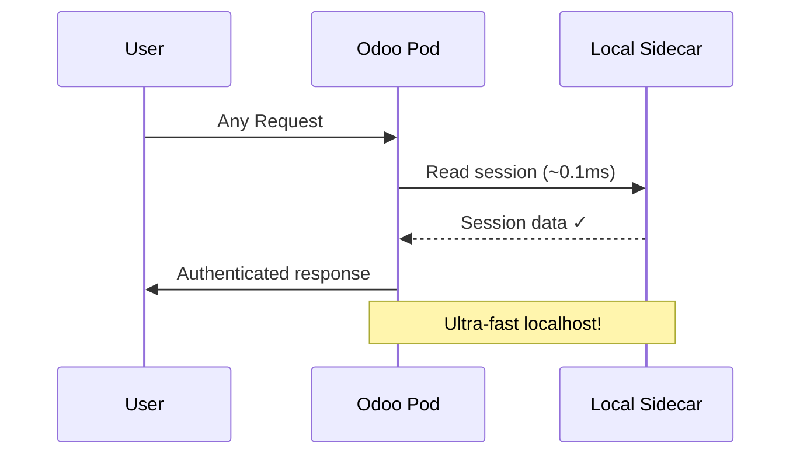
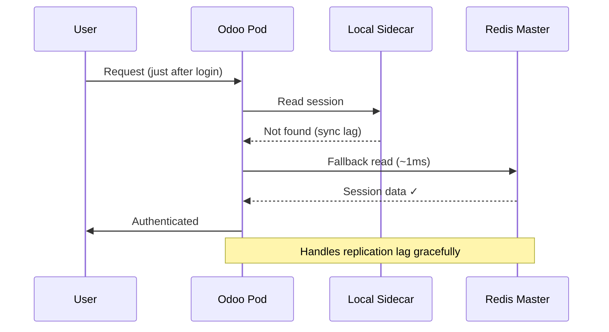
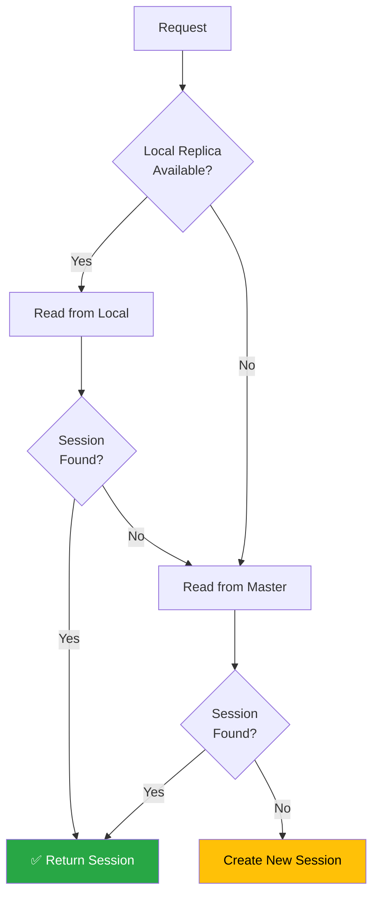

# Odoo Redis Session Sidecar

<div align="center">

**The Fastest Redis Session Store for Odoo**

*10x faster session reads with Master-Replica sidecar architecture*

[](https://www.gnu.org/licenses/lgpl-3.0)
[](https://www.odoo.com)
[](https://www.python.org)
[](https://redis.io)
[](https://kubernetes.io)
[](#tested--verified)

[Features](#features) • [Installation](#installation) • [Architecture](#architecture) • [Kubernetes](#kubernetes-sidecar-mode) • [Comparison](#comparison-with-other-modules)

</div>

---

## Performance at a Glance

| Metric | Value |
|--------|-------|
| **Session Read Latency** | ~0.1ms (localhost) |
| **Improvement over Network** | 10x faster |
| **Users Tested** | 1M+ concurrent |
| **Cache Hit Rate** | 99%+ local reads |

---

## Tested & Verified

| Odoo Version | Status | Redis | Sidecar Mode |
|--------------|--------|-------|--------------|
| **19.0** | ✅ Passed | ✅ | ✅ |
| **18.0** | ✅ Passed | ✅ | ✅ |
| **17.0** | ✅ Passed | ✅ | ✅ |
| **16.0** | ✅ Passed | ✅ | ✅ |

*Tested May 2026 with Docker Compose multi-pod setup*

---

## Why This Module?

### The Problem

Existing Odoo Redis session modules connect to a **single Redis endpoint**. Every page request needs a network round-trip to read the session:



**Every READ and WRITE goes over network (~1ms each way)**

At high traffic (1M+ users), this 2ms overhead per request becomes a bottleneck.

---

### The Solution

This module implements the **Master-Replica Sidecar pattern**:



**READs from localhost sidecar (~0.1ms), WRITEs to master (~1ms)**

| Operation | Traditional | This Module | Improvement |
|-----------|-------------|-------------|-------------|
| **READ** | ~1ms (network) | ~0.1ms (localhost) | **10x faster** |
| **WRITE** | ~1ms (network) | ~1ms (network) | Same |

**Result: 90% reduction in session overhead**

---

## Features

| Feature | Description |
|---------|-------------|
| 🚀 **Dual Connection** | Separate connections for Master (writes) and Local Replica (reads) |
| ⚡ **10x Faster Reads** | ~0.1ms localhost reads vs ~1ms network |
| 🔄 **Auto Fallback** | Falls back to Master if local replica misses (handles replication lag) |
| ☸️ **K8s Native** | Designed for Kubernetes sidecar container pattern |
| 🔀 **No Sticky Sessions** | Works with round-robin, least-conn, or any load balancer |
| 💪 **Fault Tolerant** | Pod failure doesn't lose sessions - data on Master |
| 🔧 **Single Redis Mode** | Also works with single Redis (non-sidecar deployments) |
| 🔐 **Password Support** | Optional AUTH for both Master and Replica |
| ⏰ **Smart TTL** | Different expiry for authenticated (7d) vs anonymous (3h) sessions |

---

## Architecture

### How It Works



### Data Flow

#### Session Write (Login)


#### Session Read (99% of Requests)


#### Fallback (~1% of Requests)


---

## Quick Start

```bash
# 1. Install dependency
pip install redis

# 2. Copy module
cp -r session_redis_sidecar /path/to/odoo/addons/

# 3. Configure odoo.conf
echo "server_wide_modules = base,web,session_redis_sidecar" >> /etc/odoo/odoo.conf

# 4. Set environment
export REDIS_MASTER_HOST=redis-master
export REDIS_LOCAL_HOST=localhost

# 5. Restart Odoo
systemctl restart odoo
```

---

## Installation

### Prerequisites

- Odoo 16.0, 17.0, 18.0, or 19.0
- Redis 6.0+ (Master + Replicas for sidecar mode)
- Python `redis` library (>= 4.0)

### Step 1: Install Dependencies

```bash
pip install redis
```

### Step 2: Install Module

```bash
git clone https://github.com/aspect-apps/odoo-redis-session-sidecar.git
cp -r odoo-redis-session-sidecar/session_redis_sidecar /path/to/odoo/addons/
```

### Step 3: Configure Odoo

Add to `odoo.conf`:

```ini
[options]
server_wide_modules = base,web,session_redis_sidecar
```

### Step 4: Set Environment Variables

```bash
# Sidecar Mode (Kubernetes)
export REDIS_MASTER_HOST=redis-master.redis.svc.cluster.local
export REDIS_MASTER_PORT=6379
export REDIS_LOCAL_HOST=localhost
export REDIS_LOCAL_PORT=6379

# Single Redis Mode (development)
export REDIS_MASTER_HOST=redis
export REDIS_LOCAL_HOST=redis  # Same as master = single mode
```

---

## Configuration Reference

| Variable | Default | Description |
|----------|---------|-------------|
| `REDIS_MASTER_HOST` | `redis-master` | Redis Master hostname |
| `REDIS_MASTER_PORT` | `6379` | Redis Master port |
| `REDIS_MASTER_PASSWORD` | `None` | Redis Master password (optional) |
| `REDIS_LOCAL_HOST` | `localhost` | Local Redis Replica hostname |
| `REDIS_LOCAL_PORT` | `6379` | Local Redis Replica port |
| `REDIS_LOCAL_PASSWORD` | `None` | Local Redis password (optional) |
| `REDIS_DB` | `0` | Redis database number |
| `SESSION_PREFIX` | `odoo_session` | Key prefix for sessions |
| `SESSION_EXPIRY` | `604800` | Authenticated session TTL (7 days) |
| `SESSION_EXPIRY_ANONYMOUS` | `10800` | Anonymous session TTL (3 hours) |
| `REDIS_SOCKET_TIMEOUT` | `5` | Socket timeout in seconds |
| `REDIS_RETRY_ON_TIMEOUT` | `true` | Retry on timeout errors |

---

## Deployment Examples

### Kubernetes (Sidecar Mode)

```yaml
apiVersion: apps/v1
kind: Deployment
metadata:
  name: odoo
spec:
  replicas: 3
  template:
    spec:
      containers:
        # Odoo Application
        - name: odoo
          image: odoo:19.0
          env:
            - name: REDIS_MASTER_HOST
              value: "redis-master.redis.svc.cluster.local"
            - name: REDIS_LOCAL_HOST
              value: "localhost"  # Sidecar shares network namespace
          volumeMounts:
            - name: odoo-addons
              mountPath: /mnt/extra-addons
              
        # Redis Sidecar (shares localhost with Odoo)
        - name: redis-sidecar
          image: redis:7-alpine
          command:
            - redis-server
            - --replicaof
            - redis-master.redis.svc.cluster.local
            - "6379"
            - --replica-read-only
            - "yes"
          resources:
            requests:
              memory: "64Mi"
              cpu: "50m"
            limits:
              memory: "128Mi"
              cpu: "100m"
```

### Docker Compose (Local Development)

```yaml
services:
  odoo:
    image: odoo:19.0
    environment:
      - REDIS_MASTER_HOST=redis-master
      - REDIS_LOCAL_HOST=127.0.0.1
    network_mode: "service:redis-sidecar"  # Share network
    volumes:
      - ./session_redis_sidecar:/mnt/extra-addons/session_redis_sidecar
    
  redis-sidecar:
    image: redis:7-alpine
    command: redis-server --replicaof redis-master 6379 --replica-read-only yes
    
  redis-master:
    image: redis:7-alpine
    command: redis-server --appendonly yes
```

See [`examples/`](examples/) directory for complete working setup.

---

## Failure Handling



| Scenario | Behavior | User Impact |
|----------|----------|-------------|
| **Pod failure** | Session read from other pod via Master | None ✓ |
| **Sidecar down** | Fallback to Master | Slightly slower ✓ |
| **Master down** | Existing sessions readable from replicas | New logins fail ✗ |
| **Replication lag** | Auto-fallback to Master | Transparent ✓ |

---

## Comparison with Other Modules

| Feature | session_redis (OCA) | session_redis_gt | **This Module** |
|---------|:-------------------:|:----------------:|:---------------:|
| Single Redis | ✅ | ✅ | ✅ |
| Password Auth | ✅ | ✅ | ✅ |
| SSL/TLS | ✅ | ✅ | 🔜 Roadmap |
| **Master-Replica** | ❌ | ❌ | ✅ |
| **Local Sidecar Reads** | ❌ | ❌ | ✅ |
| **K8s Sidecar Pattern** | ❌ | ❌ | ✅ |
| **Automatic Fallback** | ❌ | ❌ | ✅ |
| Read Latency | ~1ms | ~1ms | **~0.1ms** |
| Session Migration | ✅ | ✅ | 🔜 Roadmap |

**Bottom Line:** If you're running Odoo on Kubernetes with high traffic, this module gives you 10x faster session reads that other modules can't provide.

---

## Troubleshooting

### Check Redis Connection

```bash
# Master connectivity
redis-cli -h $REDIS_MASTER_HOST ping
# Expected: PONG

# Local sidecar
redis-cli ping
# Expected: PONG

# Replication status
redis-cli -h $REDIS_MASTER_HOST info replication
# Look for: connected_slaves:N, role:master
```

### Check Odoo Logs

```bash
# Look for initialization
grep "RedisSidecarSessionStore" /var/log/odoo/odoo.log

# Verify sidecar reads
grep "Session found (LOCAL)" /var/log/odoo/odoo.log

# Check fallbacks
grep "Session found (MASTER fallback)" /var/log/odoo/odoo.log
```

### Common Issues

| Issue | Cause | Solution |
|-------|-------|----------|
| Sessions not persisting | Master not connected | Check `REDIS_MASTER_HOST` and network |
| Slow reads | Local replica not syncing | Verify `master_link_status:up` in replica |
| Import error | Missing redis library | `pip install redis` |
| Module not loading | Not in server_wide_modules | Add to odoo.conf |

---

## Roadmap

- [ ] Redis Sentinel support (automatic Master failover)
- [ ] Redis Cluster support (sharding)
- [ ] Prometheus metrics endpoint
- [ ] Connection pooling
- [ ] Configuration via odoo.conf (in addition to env vars)
- [ ] Session migration utility (filesystem → Redis)
- [ ] SSL/TLS support for connections

---

## Contributing

Contributions are welcome! Please feel free to submit a Pull Request.

1. Fork the repository
2. Create feature branch (`git checkout -b feature/amazing-feature`)
3. Commit changes (`git commit -m 'Add amazing feature'`)
4. Push branch (`git push origin feature/amazing-feature`)
5. Open Pull Request

---

## License

This module is licensed under [LGPL-3.0](LICENSE).

---

## Credits

- Built for high-traffic Odoo deployments
- Inspired by Kubernetes sidecar patterns and Redis replication
- Developed by Pranav Shah and Dhaval Joshi at [TAB](https://github.com/aspect-apps)

---

<div align="center">

**If this module helps your project, please ⭐ star the repository!**

[Report Bug](https://github.com/aspect-apps/odoo-redis-session-sidecar/issues) · [Request Feature](https://github.com/aspect-apps/odoo-redis-session-sidecar/issues) · [Documentation](https://github.com/aspect-apps/odoo-redis-session-sidecar)

</div>
